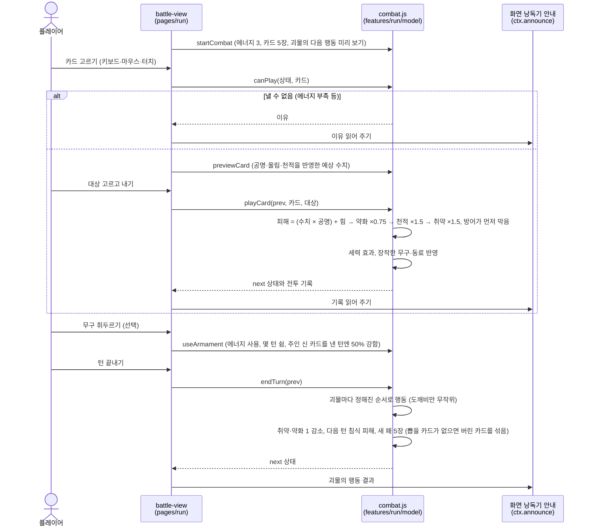
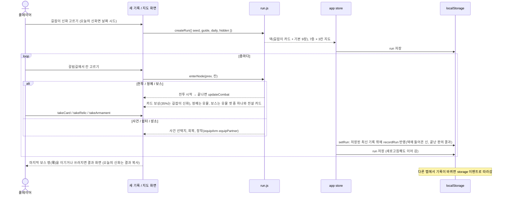

# 시퀀스 다이어그램

ZERO는 서버 없이 브라우저에서만 동작하는 순수 자바스크립트 게임입니다. 상태는 불변 객체로 다루며(`prev → next`), 진행 상황은 localStorage에 남습니다. 수치 규칙은 [카드 규칙](card-rules.md)에 있습니다.

## 1. 전투 한 턴

```mermaid
sequenceDiagram
    actor 플레이어
    participant 화면 as battle-view<br/>(pages/run)
    participant 전투 as combat.js<br/>(features/run/model)
    participant 안내 as 화면 낭독기 안내<br/>(ctx.announce)

    화면->>전투: startCombat (에너지 3, 카드 5장, 괴물의 다음 행동 미리 보기)
    플레이어->>화면: 카드 고르기 (키보드·마우스·터치)
    화면->>전투: canPlay(상태, 카드)
    alt 낼 수 없음 (에너지 부족 등)
        전투-->>화면: 이유
        화면->>안내: 이유 읽어 주기
    else
        화면->>전투: previewCard (공명·울림·천적을 반영한 예상 수치)
        플레이어->>화면: 대상 고르고 내기
        화면->>전투: playCard(prev, 카드, 대상)
        전투->>전투: 피해 = (수치 × 공명) + 힘 → 약화 ×0.75 → 천적 ×1.5 → 취약 ×1.5, 방어가 먼저 막음
        전투->>전투: 세력 효과, 장착한 무구·동료 반영
        전투-->>화면: next 상태와 전투 기록
        화면->>안내: 기록 읽어 주기
    end
    플레이어->>화면: 무구 휘두르기 (선택)
    화면->>전투: useArmament (에너지 사용, 몇 턴 쉼, 주인 신 카드를 낸 턴엔 50% 강함)
    플레이어->>화면: 턴 끝내기
    화면->>전투: endTurn(prev)
    전투->>전투: 괴물마다 정해진 순서로 행동 (도깨비만 무작위)
    전투->>전투: 취약·약화 1 감소, 다음 턴 침식 피해, 새 패 5장 (뽑을 카드가 없으면 버린 카드를 섞음)
    전투-->>화면: next 상태
    화면->>안내: 괴물의 행동 결과
```

## 2. 한 판의 진행과 자동 저장

```mermaid
sequenceDiagram
    actor 플레이어
    participant 페이지 as 새 기록 / 지도 화면
    participant 진행 as run.js
    participant 스토어 as app store
    participant 저장 as localStorage

    플레이어->>페이지: 길잡이 신화 고르기 (오늘의 신화면 날짜 시드)
    페이지->>진행: createRun({ seed, guide, daily, hidden })
    진행-->>스토어: 덱(길잡이 카드 + 기본 9장), 7층 × 3칸 지도
    스토어->>저장: run 저장
    loop 층마다
        플레이어->>페이지: 갈림길에서 칸 고르기
        페이지->>진행: enterNode(prev, 칸)
        alt 전투 / 정예 / 보스
            진행-->>페이지: 전투 시작 → 끝나면 updateCombat
            진행-->>페이지: 카드 보상(35%는 길잡이 신화), 정예는 유물, 보스는 유물 셋 중 하나와 전설 카드
            플레이어->>페이지: takeCard / takeRelic / takeArmament
        else 사건 / 쉼터 / 성소
            진행-->>페이지: 사건 선택지, 회복, 장착(equipArm·equipPartner)
        end
        스토어->>저장: setRun: 저장된 최신 기록 위에 recordRun 반영(덱에 들어온 신, 끝난 판의 결과)
        스토어->>저장: run 저장 (새로고침해도 이어 감)
    end
    페이지-->>플레이어: 마지막 보스 영(零)을 이기거나 쓰러지면 결과 화면 (오늘의 신화는 결과 복사)
    Note over 저장: 다른 탭에서 기록이 바뀌면 storage 이벤트로 따라감
```
